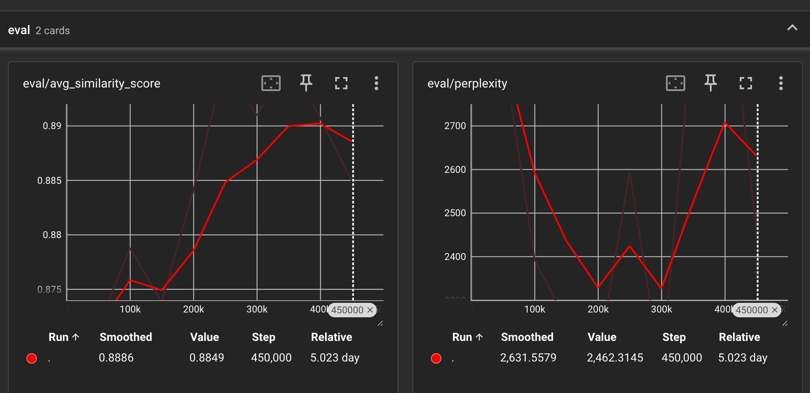
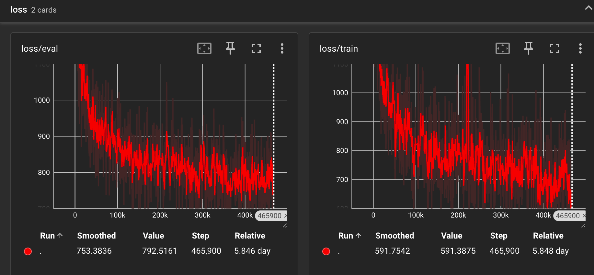

<h1 align="center">Work Log for Email Data Generation using Deep Learning</h1>

Project for deep-learning-based email generator.

[Full Documentation](https://plamephiaj.github.io/data-sythesis-research/design/readme.html)

# Data Sythesis Research: Rule-guided Discrete Diffusion for Email Generation

# Soft Links in this project
- data --> /home/shared_folder/shared_datasets/data-sythesis-research/data
- data_phish --> /home/shared_folder/shared_datasets/data-sythesis-research/data_phish

# Reverse Chronological Order

## Feb 23rd, 2026 Update
### Yuhao:
1. Added evaluation script for the detection model. New Nazario dataset is used for evaluation. The evaluation process is:
    - Train the detection model with training set.
    - Evaluate the detection model on the Nazario dataset and calculate metrics such as accuracy, precision, recall, F1 score, and AUC-ROC.
    - Get all wrongly classified samples and generate their corresponding captions.
    - Select 1%, 5%, 10%, 20% of the wrongly classified samples to feed into the email generator.
    - Use generated emails to augment the training set and retrain the detection model.
    - Evaluate the retrained detection model on the Nazario dataset and compare the results with the original detection model.
    - If original detection model's performance is improved after augmentation, then the generated emails are considered to be helpful for improving the detection model.
    - If the original model is too strong, use limited training data to train a weaker detection model for better observation of the improvement brought by the generated emails.

## Feb 20th, 2026 Update
### Yuhao:
1. Added MAUVE metric for evaluating the quality of generated emails. The MAUVE score is calculated between the generated emails and the real emails in the validation set. The MAUVE score is a measure of how well the distribution of generated emails matches the distribution of real emails, with higher scores indicating better quality.
1. Bug fix.
1. Do more low data ratio experiments, cuurently considering to augment dataset based on low data ratio results to further improve the model performance.

## Feb 19th, 2026 Update
### Yuhao:
1. Force data preprocessing to only keep one EOS token at the end of the email text.

## Feb 13th, 2026 Update
### Yuhao:
1. Our model training is finished. Added raw SEDD implementation for contrast experiments. All raw source code has the suffix `_raw` to distinguish from the main implementation. Neither style controlled generation nor `EOS` prediction support in the raw implementation.
1. Decoupled training configuration for different machine capabilities. The new worker namespace in the `config.yaml` is set to include specific machine settings, such as `gpuserver` or `cavserver`, etc.

## Feb 10th, 2026 Update
### Yuhao:
1. Updated detection model training code. Supported compute canada's cluster environment and added some code refactoring for better maintainability.

## Feb 9th, 2026 Update
### Yuhao:
1. Updated sampling code to support conditioned generation.
1. Added raw implementation to be used for contrast experiments.

## Feb 2nd, 2026 Update
### Yuhao:
1. Added phish mark in the description for future email generation sampling.
1. Added training script for detection model using Huggingface transformers. The detection model is a fine-tuned BERT model for binary classification of phishing emails.

## Jan 23rd, 2026 Update
### Yuhao:
1. Update dataset statistics after data cleaning. The result are as follows:
- [dataset] split=train, dataset_len=172233, examples=172233, batches=1346
- [train] text: total_tokens=50359881, mean=292.39±278.22, min=19, q25=89, median=183, q75=406, p90=813, p95=1000, p99=1024, max=1024, max_len=1024, pad_rate=71.45%, sample_n=50000
- [train] caption: total_tokens=5789547, mean=33.61±13.33, min=6, q25=25, median=31, q75=40, p90=50, p95=58, p99=79, max=251, max_len=256, pad_rate=86.87%, sample_n=50000
- [dataset] split=validation, dataset_len=19115, examples=19115, batches=38
- [validation] text: total_tokens=5602756, mean=293.11±278.76, min=22, q25=92, median=180, q75=396, p90=765, p95=983, p99=1024, max=1024, max_len=1024, pad_rate=71.38%, sample_n=19115
- [validation] caption: total_tokens=644832, mean=33.73±13.48, min=7, q25=25, median=31, q75=40, p90=50, p95=59, p99=81, max=182, max_len=256, pad_rate=86.82%, sample_n=19115

## Jan 21st, 2026 Update
### Yuhao:
1. The PPL has significantly dropped after adding eos penalty during sampling.
1. Fixed the bug of OOM triggered by long sequences during evaluation. The evaluation dataloader now clamps the length to the model's max length.

## Jan 20th, 2026 Update
### Yuhao:
1. It is found that during evaluation, the perplexity is calculated on all tokens including the masked tokens, which may lead to misleading results. Added truncation in the evaluation code to calculate perplexity only on the non-masked tokens.
1. Added eos penalty during sampling to penalize model from not generating eos token. This is to avoid the situation where the model never generates eos token and keeps generating tokens until reaching max length.
1. Made some code refactoring to improve efficiency like using singleton pattern for logger, tokenizers, evaluation models, etc.

## Jan 19th, 2026 Update
### Yuhao:
1. Added truncation in the evaluation code to calculate perplexity only on the non-masked tokens.

## Jan 16th, 2026 Update
### Yuhao:
1. Added CFG inference support in sampling code.

## Jan 12th, 2026 Update
### Yuhao:
1. The first round of cross-attention based demo training has been completed. The model is able to generate emails that reflect the style indicated by the caption and the semantic alignment metric is going up, which is a good sign.
1. New semantic-alignment-loss training is ongoing. The loss is added to the original SEDD loss to further improve the alignment between generated email and style caption.
1. The very long feedback loop of training-testing-debugging is quite time-consuming. More powerful GPUs with larger VRAM would be very helpful to speed up the iteration cycle.

## Jan. 7th, 2026 Update
### Yuhao:
1. Added semantic alignment loss to the training objective. The semantic alignment loss encourages the generated email to be semantically aligned with the style caption by minimizing the cosine distance between their embeddings. The caption embeddings are obtained from a pre-trained BERT model. The email embeddings are obtained by getting the pooled hidden states from the last layer of the SEDD model.
1. The total loss is now a weighted sum of the original SEDD loss and the semantic alignment loss. The weight of the semantic alignment loss is controlled by a hyperparameter `alpha_align`.
1. Many structural changes in the codebase to support the new loss function. See git changes for details.

## Jan. 6th, 2026 Update
### Yuhao:
1. Restart training of `cross_attn_style`. Added email data cleaning step to remove special characters and symbols from the email text.
1. Added semantic alignment metric to evaluate the alignment between generated email and style caption. Using `metric` package with pre-trained `intfloat/e5-base-v2` model. More metric options are under design.

## Jan. 5th, 2026 Update
### Yuhao:
1. The first attempt of training with simple addtion of caption embedding and time step embedding did yield some promising results. The model is able to generate emails that somewhat reflect the style indicated by the caption.
1. The perplexity is at 1 thousand level after training. Considering whether this is because the lack of the data cleaning step. Currently, no symbols, special characters are removed from the email text. But the final results are somehow readable.
1. Refactored the `transformer.py` to add cross-attention layer for caption embedding. The cross-attention layer is added after the self-attention layer in each transformer block. Now it can support 3 modulation methods:
    - `sigma_only`: only use time step embedding for modulation.
    - `sigma_plus_style`: add time step embedding and caption embedding together for modulation. (This is the previous implementation, quite straightforward but may lack of fine control granularity compared to cross-attention)
    - `cross_attn_style`: use time step embedding for modulation and caption embedding as tokens for cross-attention. (Ongoing training)
1. Need to consider more about the evaluation metrics for style-conditioned generation. Perplexity may not be the best choice here. Currently thinking about using a pre-trained classifier to evaluate whether the generated email matches the desired style. Borrowing ideas from image generation field, such as using CLIP score, FID or IS.

## Dec. 19th, 2025 Update
### Yuhao:
1. Added caption and mask support in sampling code.
1. Now the model can generate emails conditioned on style captions. The first 500k iterations of training's results seem promising.
1. Solved a batch size mismatch bug in the sampling phase, the small model has the length 1024 while the evaluation dataloader config has length 2048. Solved by clamping the length to the model's max length.
1. Thought for different ways to integrate guidance into the DDiT model. The current implementation is to concatenate the caption embedding with the time step embedding and feed it into the transformer blocks, which is quite straightforward but may lack of the fine control granularity (cannot control relative strength of time step embedding and caption embedding). The new idea is to add an additional cross-attention layer in each transformer block to attend to the caption embedding, which may provide better control over the generation process.
1. Plan for the coming Christmas holidays:
    - Run the training and observe the sampling results.
    - Neaten the codebase to be more maintainable.
    - If the first round training can be finished, put cross-attention based guidance into practice.

## Dec. 18th, 2025 Update
### Yuhao:
1. Bug fixes in flash attention implementation with masked input.
1. Add classifer-free guidance support for training.
1. The code is now able to run training with masked input and classifier-free guidance. First experiments will be conducted.
1. Add `tensorboard` logging. Dependency added in `pyproject.toml`.

## Dec. 16th, 2025 Update
### Yuhao:
1. Tested the data loading pipeline for the phishing email dataset.
    - The processed data contains `text`, `text_mask`, `style_caption`, `style_caption_mask` fields.
1. Modify code to support masked input during training, including updates to graph, transformer, and score entropy calculation, etc.
1. Currently, the condition is modulated with time step embedding. The effect is going to be investigated.
1. All closure design patterns are refactored to class-based design patterns for better readability and maintainability.

## Dec. 15th, 2025 Update
### Yuhao:
- Finished data processing and loading for the phishing email dataset.
- Now the phishing email dataset can be used for unconditional training.
- Updated `configs/data/default.yaml` to include the phishing email dataset as the default dataset.
- Updated `src/train/run_train.py` to accommodate the new data format with `text_input_ids`.

## Dec. 10th, 2025 Update
### Yuhao:
- Refactored data loading code in `src/data_process/data.py` to decouple dataset loading and data processing.
- Introduced `configs/data/*.yaml` to manage data-related configurations.
- Updated `configs/config.yaml` and dataset-specific config files to align with the new data configuration structure.
- The original data loading logic is mainly used for language modeling tasks, which can only support chunk-based data formats. The newly added structure allows for condition - text entry based data formats.

## Dec. 5th, 2025 Update
### Yuhao:
- Added comments in source code to clarify details of the score entropy discrete diffusion model.
- Methods studies in progress.

## Dec. 1st, 2025 Update
### Yuhao:
- Updated `src/data_process/README.md` to include detailed workflow for data processing.
- Added note in `src/data_process/llm/style_caption.py` about Ollama's speed and future work considerations.
- Created `WORK_LOG.md` to track changes and updates in the project.
- Finished examining the extracted dataset in `data_phish/jsonl`. Now we have 203,793 emails with brief captions. `Overall benign=109465 phish=94328  phish_ratio=46.29% total_samples=203793`
