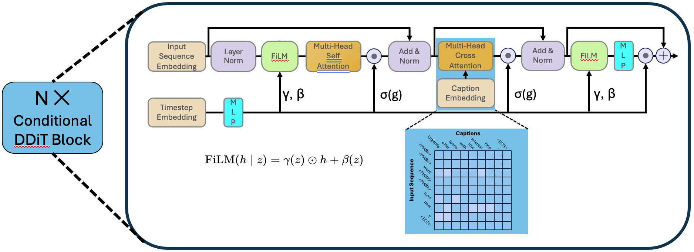

# Style-controlled Phishing Email Data Generation with Score Entropy Discrete Diffusion

The diffusion model is one of the earliest generative models used for image generation, and in recent years it has also been applied to text generation tasks. Compared with traditional GPT-based autoregressive text generation models, diffusion models perform well in terms of diversity. However, approaches that rely purely on data-driven generation may overlook domain-specific rules and constraints, leading to results that do not meet expectations. In phishing email generation, following certain rules (such as including specific phishing keywords or mimicking the format of real emails) is crucial for producing high-quality phishing emails. To address this issue, we aim to explore a style-controlled discrete diffusion model approach that integrates style captions into the generation process, thereby improving both the quality and diversity of phishing email outputs.

## Methodology

### The process of traditional continuous-space diffusion models
The working process of traditional continuous-space diffusion models mainly includes two steps: noise addition and denoising. In the noise addition process, a Markov chain is used to gradually add noise to the data until it eventually becomes pure noise. The denoising process, on the other hand, is a reverse Markov chain, in which the model learns to recover the data from noise at each time step, thereby enabling generation. Specifically:
- Forward process (adding noise):
    $$
    q(x_t|x_{t-1})=\mathcal{N}(x_t;\sqrt{1-\beta_t}x_{t-1},\beta_tI)
    $$
    In the text scenario, this can be: token embedding → add noise → obtain $x_t$.
Here, $\beta_t$ is a predefined noise schedule that controls the amount of noise added at each step; as $t$ approaches $T$, $x_t$ gradually becomes pure noise.
- Reverse process (denoising):
    $$
    p_\theta(x_{t-1}|x_t)=\mathcal{N}(x_{t-1};\mu_\theta(x_t,t),\Sigma_\theta(x_t,t))
    $$
    $$
    \mu_\theta(x_t,t)=\frac{1}{\sqrt{1-\beta_t}}\left(x_t-\frac{\beta_t}{\sqrt{1-\bar{\alpha}_t}}\epsilon_\theta(x_t,t)\right)
    $$
    The model learns $\epsilon_\theta(x_t,t)$ and gradually recovers $x_0$.
    In the reverse process, the model learns a parameterized noise predictor $\epsilon_\theta(x_t,t)$ to estimate the ability to recover the original data $x_0$ from the noisy data $x_t$ at each time step $t$. The training objective is to minimize the mean squared error between the predicted noise and the actual added noise. During the sampling phase, the model iteratively applies the reverse process to gradually remove noise from the noisy data, ultimately generating high-quality samples.
- Training objective:
    $$
    L_{simple}=\mathbb{E}_{t,x_0,\epsilon}[\|\epsilon-\epsilon_\theta(x_t,t)\|^2]
    $$

### Discrete diffusion for text generation
Since text is discrete, performing diffusion directly in the text space is relatively difficult. Therefore, recent diffusion models typically conduct diffusion in a discrete space. Discrete diffusion language models are modeled using a continuous-time, discrete-space Markov chain. Specifically, the diffusion process for a position in a sequence is defined as:
$$
p(x_{t+\Delta t}=y\mid x_t=x)=\delta_{xy}+Q_t(y,x)\Delta t+O(\Delta t)
\begin{array}
{cc}\delta_{xy}=
\begin{cases}
1, & x=y \\
0, & x\neq y & &
\end{cases}
\end{array}
$$
Here, x and y are discrete text representations (such as token IDs), and $Q_t$ is a manually predefined time-dependent transition matrix that defines the probability of transitioning from one token to another.
In general, $Q_t$ can be designed as a simple uniform transition matrix (where each token transitions to other tokens with equal probability, commonly referred to as $Q^{uniform}$), or it can be designed according to specific rules (for example, some tokens are more likely to transition to specific tokens, or tokens can only transition to specific mask tokens, commonly referred to as $Q^{absorb}$). During training, the model needs to learn to predict the distribution of the next state $x_{t+\Delta t}$ given the current state $x_t$ and time step $t$.

Similarly, the reverse process can be written as:
$$
p(x_t=x\mid x_{t+\Delta t}=y)=\delta_{yx}+\overline{Q}_t(x,y)\Delta t+O(\Delta t)
$$
Here, $\overline{Q}_t$ is the reverse transition matrix, defining the probability of transitioning from one token to another in the reverse process. The model needs to learn to predict the distribution of the previous state $x_t$ given the current state $x_{t+\Delta t}$ and time step $t$. Through Bayesian inversion, the reverse transition matrix $\overline{Q}_t$ can be expressed as a function of the forward transition matrix $Q_t$ and the data distribution $p(x)$.
$$
\overline{Q}_t(y,x)=\frac{p_t(y)}{p_t(x)}Q_t(x,y)
$$
Here, $\frac{p_t(y)}{p_t(x)}$ is called the concrete score, reflecting the relative importance or probability of token $y$ compared to token $x$ at time step $t$.

The goal of discrete language diffusion models is to predict this concrete score, thereby enabling the generation process from noise to text through reverse Markov diffusion. The model can be parameterized as $s_\theta(x,t)$, which is trained to approximate the concrete score:
$$s_\theta(x,t)\approx\left[\frac{p_t(y)}{p_t(x)}\right]_{y\neq x}$$

The training objective is to minimize the difference between the predicted concrete score and the actual concrete score, typically measured using Bregman divergence:
$$
\mathbb{E}_{x\thicksim p}\left[\sum_{y\neq x}w_{xy}\left(s_\theta(x)_y-\frac{p(y)}{p(x)}\log s_\theta(x)_y+K\left(\frac{p(y)}{p(x)}\right)\right)\right]
$$
where $K(a)=a(\log a-1)$
Here, the ground truth concrete score $\frac{p(y)}{p(x)}$ is based on the true data distribution. However, in practice, we often use a predefined transition matrix $Q_t$ to approximate this distribution, resulting in a computable objective function. This is the core of diffusion model training:

$$
\mathbb{E}_{x_0 \sim p_0,\, x \sim p(\cdot \mid x_0)}\left[
\sum_{y \ne x} w_{xy}\left(s_\theta(x)_y-\frac{p(y \mid x_0)}{p(x \mid x_0)}\log s_\theta(x)_y
\right)
\right]
$$
$p(x|x_0)$ and $p(y|x_0)$ are both distributions defined by the forward diffusion process and are approximated using the predefined transition matrix $Q_t$.

### Incorporate features into discrete language diffusion
Purely data-driven discrete diffusion language modeling cannot guarantee that the generated text satisfies specific rules or constraints. To guide the generation process and ensure that the diffusion language model produces the content we desire, we can improve generation quality through the following approaches:

#### Classifier-free guidance
In continuous-space diffusion models, classifier-free guidance is a common technique that trains an unconditional model by randomly dropping conditional information (such as class labels) during training, allowing the generation of specific attributes to be enhanced by adjusting the difference between the conditional and unconditional model outputs during sampling. For discrete language diffusion models, we can adopt a similar approach by treating rules as conditional information and randomly dropping these rules during training to train an unconditional model. This way, during sampling, we can enhance the model's ability to generate text that satisfies specific rules by adjusting the difference between the conditional and unconditional model outputs.

Specifically, the model input can include the current state of the text $x_t$, the time step $t$, and the rule condition $c$ (e.g., a natural language prompt describing the desired content). The model then becomes $s_\theta(x,t,c)$, which is trained to approximate the concrete score under the condition of $c$:
$$s_\theta(x,t,c)\approx\left[\frac{p_t(y)}{p_t(x)}\right]_{y\neq x}$$
The training objective then becomes
$$
\mathbb{E}_{(x_0, c) \sim p_0,\, x \sim p(\cdot \mid x_0)}\left[
\sum_{y \ne x} w_{xy}\left(s_\theta(x, c)_y-\frac{p(y \mid x_0)}{p(x \mid x_0)}\log s_\theta(x, c)_y
\right)
\right]
$$

During training, we randomly drop the rule condition $c$, allowing the model to learn to generate text without rule guidance. Then, during sampling, we can enhance the model's ability to generate text that satisfies specific rules by adjusting the difference between the conditional and unconditional model outputs. Specifically, we can use the following formula to adjust the model output:
$$s_{guided}(x,t,c) = s_\theta(x,t,c) + \lambda (s_\theta(x,t,c) - s_\theta(x,t))$$
Here, $s_\theta(x,t)$ is the output of the unconditional model (i.e., when $c$ is dropped), and $\lambda$ is a hyperparameter that controls the strength of the guidance. By increasing $\lambda$, we can enhance the model's ability to generate text that satisfies the specific rules described by $c$.

#### Information Noise Contrastive Estimation
Information Noise Contrastive Estimation (InfoNCE) is a technique used to train models to distinguish between positive and negative samples. In discrete language diffusion models, we can use InfoNCE to supervise the relationship between the model's latent space representation and the rules. Specifically, InfoNCE is defined as
$$
\mathcal{L}_{\mathrm{InfoNCE}}=-\log\frac{\exp(s(q,k^+)/\tau)}{\sum_{k\in\mathcal{K}}\exp(s(q,k)/\tau)}
$$
where $q$ is the model's latent representation, $k^+$ is a positive sample related to the rule, $\mathcal{K}$ is a set containing both positive and negative samples, $s(q,k)$ is a similarity function (e.g., dot product), and $\tau$ is a temperature parameter. By minimizing the InfoNCE loss, we can encourage the model's latent representation to be more similar to positive samples related to the rules and less similar to negative samples, thereby enhancing the model's ability to generate text that satisfies specific rules.

#### End-of-sequence prediction
In discrete language diffusion models, predicting the end of a sequence is an important task. By introducing a special end-of-sequence (EOS) token, we can train the model to generate this token at the appropriate time to mark the end of the text. To enhance the model's ability to predict the EOS token, we can introduce an additional loss term during training that encourages the model to generate the EOS token at the correct position. This can be achieved as follows:
$$
\mathcal{L}_{<eos>}=-\frac{1}{B}\sum_{b=1}^B\frac{\sum_{t=1}^T\delta_{b,t}\log p_{b,t,e}}{\max\left(1,\sum_{t=1}^T\delta_{b,t}\right)}
$$
where $B$ is the batch size, $T$ is the sequence length, $\delta_{b,t}$ is an indicator function that is 1 if $t$ is the correct end position for sequence $b$ and 0 otherwise, and $p_{b,t,e}$ is the probability of the model predicting the EOS token at time step $t$. By minimizing this loss term, we can encourage the model to generate the EOS token at the correct position, thereby improving the quality and coherence of the generated text.

## Workflow of style-controlled diffusion for phishing email generation
### Dataset collection and preprocessing
First, we need to collect a corpus containing a large number of real emails. We extract relevant emails from publicly available email datasets (such as the Enron phishing email dataset) and perform cleaning and preprocessing, including removing sensitive information and standardizing text formats. Next, we need to generate corresponding style captions for each email, which can describe the content, structure, and keywords used in the email. For example, for an email containing specific phishing keywords, we can generate a caption such as "Contains keywords: account security, urgent notice." This process is automated using a locally deployed language model (such as Qwen3) and supplemented with manual review to ensure the accuracy and relevance of the captions.

### Model design
The model is based on the Score Entropy Discrete Diffusion (SEDD) framework. The original diffusion language model only supports language modeling tasks, but we need to introduce style captions as conditional information during generation. Therefore, we designed a conditional diffusion model branch to incorporate style captions. The style captions are processed through a pre-trained semantic embedding network and interact with the text generation branch via a cross-attention mechanism to guide the generation process.

### Model training
During training, we use a comprehensive loss function to optimize the model's performance. This includes the original language modeling loss (such as Bregman divergence) as well as the introduced conditional guidance losses (such as InfoNCE loss and EOS prediction loss). We train an unconditional model by randomly dropping style captions, allowing us to enhance the model's ability to generate text that satisfies specific rules by adjusting the difference between the outputs of the conditional and unconditional models during sampling. The overall training objective can be expressed as follows:
$$
\mathcal{L}=\alpha\times\mathcal{L}_{Bregman}+\beta\times\mathcal{L}_{InfoNCE}+\gamma\times\mathcal{L}_{<eos>}
$$
### Model evaluation
We will use a variety of evaluation metrics to assess the quality and diversity of the generated phishing emails. Quality evaluation will include both human review and automated metrics (such as BERT embedding similarity) to evaluate the plausibility of the generated text and its consistency with the style captions.

## References
- [Diffusion Guided Language Modeling](https://arxiv.org/abs/2408.04220v1) : ACL 2024
- [Symbolic Music Generation with Non-Differentiable Rule Guided Diffusion](https://arxiv.org/abs/2402.14285) : ICML 2024
- [Discrete Diffusion Modeling by Estimating the Ratios of the Data Distribution](https://arxiv.org/abs/2310.16834) : ICML 2024
